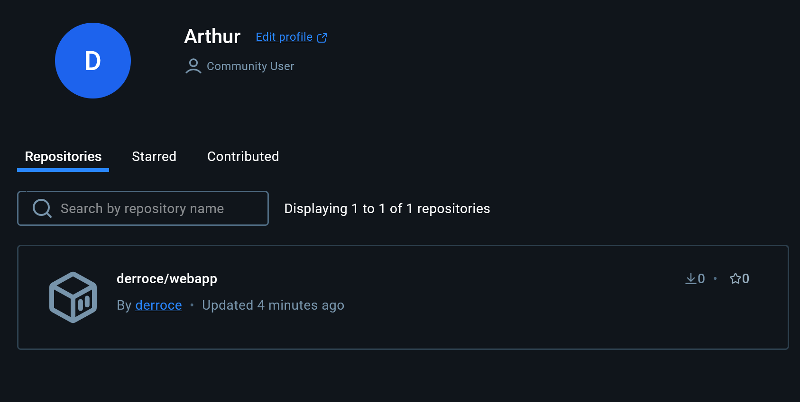

# Welcome to Docker

This is a repo for new users getting started with Docker.

You can try it out using the following command.
```
docker run -d -p 8088:80 --name welcome-to-docker docker/welcome-to-docker
```
And open `http://localhost:8088` in your browser.

## Project Images Documentation

### 1. Main Welcome Image
The main welcome image (`image.png`) provides the primary visual element for the Docker welcome page.



### 2. Secondary Welcome Image
A copy of the welcome image (`image copy.png`) serves as a backup or alternative visual element.


# Building

Maintainers should see [MAINTAINERS.md](MAINTAINERS.md).

Build and run:
```
docker build -t welcome-to-docker . 
docker run -d -p 8088:3000 --name welcome-to-docker welcome-to-docker
```
Open `http://localhost:8088` in your browser.
